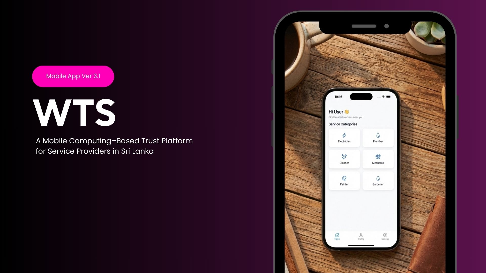
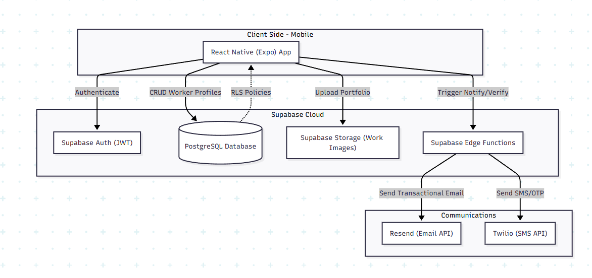
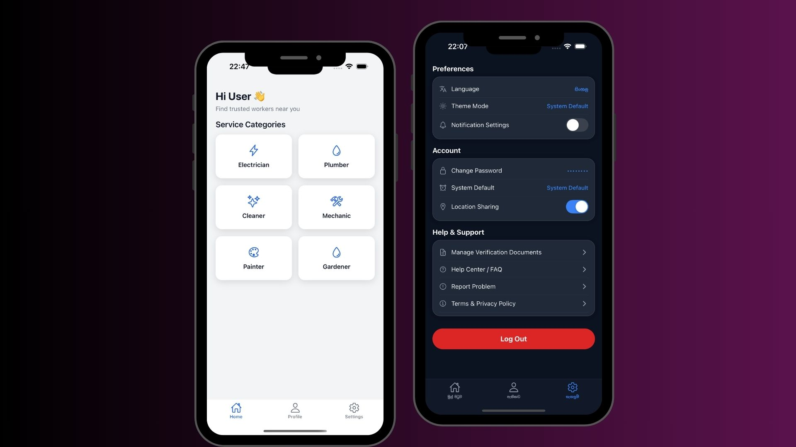

# 🛠 Worker Trust System (WTS)


<div align="center">
  
</div>

A location-based worker marketplace that connects customers with trusted local workers such as plumbers, electricians, and technicians — starting in Sri Lanka 🇱🇰.

Built with React Native (Expo) and Supabase, WTS focuses on verified registrations, geo-based matching, and future trust scoring.

## 🚀 Features

### 👷 Worker Registration

- Full name, phone, email

- Category selection (plumber, electrician, etc.)

- Work photo / ID upload

- Province / district / city auto-detection

- Latitude & longitude storage

### 📍 Smart Location Mapping

- Uses device GPS

- Reverse geocoding

- Maps coordinates to Sri Lanka provinces/districts

- Handles “Allow Once” permission edge case correctly

### 🌍 Multi-Language Support

The application supports three languages:

- 🇬🇧 English
- 🇱🇰 Sinhala (සිංහල)
- 🇱🇰 Tamil (தமிழ்)

### 🛡 SMS and Email Integration

- Admins receive an email when a worker sends application , through which they can approve or reject.

- Once admin approves, the new worker will receive a deep link through SMS.

- Using the deep link , the worker can reset his password and use the app.

### ☁ Supabase Backend

- PostgreSQL database

- Storage bucket for worker images

- Edge functions for notifications

## ⚙️ System Architecture

<div align="center">
  
</div>

---

<div align="center">
  
</div>


## ⚙️ Setup

### 1️⃣ Clone the repository

```bash
git clone https://github.com/Himindu-Kularathne/wts.git
cd worker-trust-system
```

### 2️⃣ Install dependencies

```bash
npm install
```

### 3️⃣ Create `.env`

Create a `.env` file in the root directory:

```env
EXPO_PUBLIC_SUPABASE_URL=your-url
EXPO_PUBLIC_SUPABASE_ANON_KEY=your-key
```

### 4️⃣ Start development

```bash
npx expo start
```
